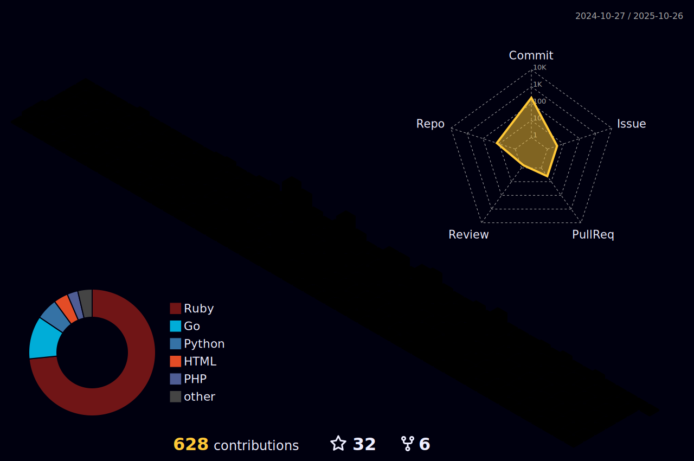

### Hi I'm Mazafard 👋
<!--
**Mazafard/Mazafard** is a ✨ _special_ ✨ repository because its `README.md` (this file) appears on your GitHub profile.

-->

## ⚡ Platforms

## ⚡ Tec Stacks

 

  

## 🌎 Find me
- email Official Account: Mazafard at gmail ✍🏾
- twitter Account: @Mazafard
- Instagram Account: @Mazafard

## 🚀 Let's support each other
These are our really cool sponsors!

<!-- sponsors --><!-- sponsors -->

## 🌎 Visitors
